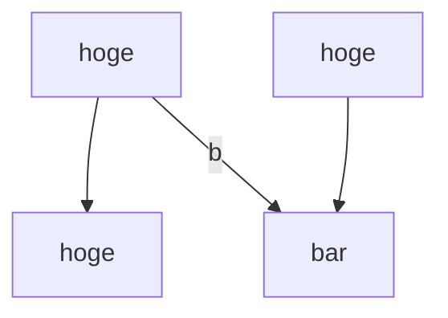

# mmd_to_pdf

## 概要

Powerpointでスライドを作成する際、GUIでのフローチャートが面倒だったので作成を決意。現時点では_急ぎ_で作成しているため、簡単なフローチャートのみの対応。

以下のようなmermaidの入力はパースできる想定

```plaintext
graph TD
    a["hoge"]
    a --> hoge
    b["hoge"] --> bar
    a -- b --> bar
```

結果イメージ


ほか、graph LRも使用可能。

### 不可なパターン

基本、簡単なフローチャート以外の出力は不可
例: `hoge --> huge --> foo`(3つ並行で連結を記述)`
